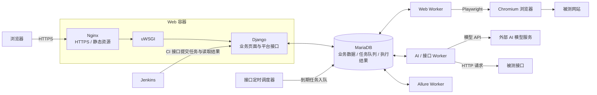

# Kiwi TCMS AI 智能测试管理平台

基于 [Kiwi TCMS](https://github.com/kiwitcms/Kiwi) 二次开发的个人实践项目，将 AI 辅助需求分析、测试用例设计与原有测试管理流程结合，用于学习、演示和软件测试项目实践。

本仓库保留 Kiwi TCMS 的原始代码、提交历史和许可证。原有测试管理能力来自上游项目；本项目的主要扩展位于 `tcms/ai_assistant/`、`tcms/web_testing/`、`tcms/allure_reporting/`，以及原有用例、计划、执行模块和平台导航、资源目录相关模板中。

## 主要扩展

- **AI 测试助手**：需求分析、开发任务单拆分与指派、测试用例生成与编辑、用例评审、覆盖分析和补充用例。「需求分析」与「任务单」是同一个功能入口下的两个 Tab：需求回答要做什么，任务单回答按什么顺序动手、怎么算做完。任务单由 AI 拆分后生成正式记录（不是草稿），可以指派给产品成员，负责人只维护状态。
- **用例库与接口自动化**：统一展示手工和自动化用例，按业务分类筛选；自动化套件支持手动、定时和 CI 触发，支持响应变量提取、单次运行 Cookie 共享、断言、失败停止、脱敏 JSON/JUnit 报告与测试运行回写；执行进程中途消失时，运行会被标记为「执行中断」，未取得结果的结果行标记为「跳过」。见 [接口自动化指南](docs/api-automation.md)。
- **Web 自动化**：业务用例关联自动化脚本，独立维护测试环境与套件；通过 Playwright 驱动 Chromium 执行操作和断言，记录步骤结果与失败截图，支持 AI 生成草稿、调试与 CI 接入。见 [Web 自动化指南](docs/web-automation.md)。
- **个人模型配置**：各账号维护自己的模型配置；未配置时提示配置；API 密钥加密保存，调用记录按账号隔离。
- **后台任务**：通过独立 worker 执行 AI 任务，显示任务阶段和进度，支持取消与重试；执行进程中途消失（断电、被强杀、崩溃）的任务会被巡检标记为「中断」，可以人工重试。
- **缺陷与回归**：失败执行分析、缺陷草稿及已有缺陷链接关联、缺陷生命周期管理、回归验证记录。
- **报告与发布门禁**：执行报告、迭代报告、报告版本与审批。发布门禁规则按**产品**配置（一个产品一条），未通过时禁止审批通过，测试经理可填写理由做**风险放行**，放行人、时间与理由进入报告版本历史；发布结论由门禁推导，不能手工填写。
- **角色与权限**：四个角色决定「能做什么」，产品成员决定「能看谁的东西」，两者互相独立，见下节。
- **使用体验**：中文界面优化、统一侧边导航、列表页的新建入口（测试计划 / 执行任务 / 缺陷）、资源树及详情查看、同一产品成员共享的自定义目录。

具体功能及权限以当前代码和实际页面为准；AI 输出需要测试人员评审后使用。

## 整体架构

项目采用 **Django 模块化单体 + 独立后台执行进程** 的架构。页面由 Django 模板渲染，JavaScript 负责目录树、表格编辑、排序和任务状态更新；不是前后端分离或微服务架构。

业务模块共用 Django 应用与 MariaDB，耗时操作交给后台 Worker。下图展示完整组件关系；不同启动配置包含的服务不同，见「运行说明」。



### 组件职责

| 组件 | 职责 |
| --- | --- |
| Django 业务后台 | 需求、开发任务单、用例、计划、执行、缺陷、质量报告、权限与模型配置 |
| MariaDB | 保存业务数据、任务状态、执行快照和结果；目前同时承担后台任务队列 |
| AI / 接口 Worker | 执行 AI 调用与接口自动化；接口执行器支持请求、断言、变量提取和 Cookie 共享 |
| Web Worker + Chromium | 通过 Playwright 执行 Web 操作与断言，记录步骤结果和失败截图 |
| Allure Worker | 根据已有执行结果生成报告，不重新执行测试 |
| 接口定时调度器 | 检查到期套件并提交任务，实际请求仍由接口 Worker 执行 |
| Jenkins | 通过平台 CI 接口触发 Web/API 套件、等待结果、发布 JUnit 与构建附件 |

- 后台采用 **数据库队列 + Worker 轮询领取**，当前没有使用 Celery、Redis 或 RabbitMQ。AI 与接口自动化共用一个 Worker 容器，Web 执行和 Allure 生成分别独立运行。
- AI 能力来自兼容 OpenAI 接口格式的外部模型服务，本项目不包含本地模型训练。
- Web 失败截图与 Allure 报告产物保存在数据库中；普通上传附件使用文件存储。数据库、附件和 Jenkins 配置需要分别持久化与备份。
- 界面中的「项目」对应 Kiwi 原有的 `Product` 模型；部分上游代码与权限名仍使用 `product`，不表示存在两套独立的项目数据。

## 核心测试链路

业务主线：

**需求 → 测试用例 → 测试计划 → 执行任务 → 缺陷 → 修复后回归 → 测试报告**

开发任务单用于补充需求对应的实施说明、接口变更及开发信息，可以关联需求和用例；它不是测试执行任务，也不是设计测试用例的必经入口。

- **用例库**保存业务测试目标、前置条件、步骤、输入数据与预期结果，不按执行工具重复维护三套业务用例。
- **测试计划**组织某个项目、版本的测试范围；一个计划可以对应多次执行任务，例如首轮测试和回归测试。
- **手工执行**由测试人员记录实际结果；**自动化执行**通过关联脚本、编排套件、选择环境，由后台 Worker 完成。
- AI 路线为「需求 → AI 生成测试场景／用例草稿 → 人工确认 → 保存用例 → 按需配置自动化 → 执行验证」。人工确认保存与正式用例评审是不同环节。
- 接口脚本不填写全局执行顺序，顺序由各套件独立保存，支持拖动或上下移动；手动、定时与 CI 触发均遵循套件顺序，重跑默认恢复源执行快照的实际顺序。见 [套件顺序说明](docs/api-suite-ordering.md)。
- 自动化结果按配置关联或回写正式执行任务，不是所有调试运行都会回写；执行快照不会因后续修改脚本或套件而被覆盖。

**平台质量报告**用于测试范围汇总、审批和发布门禁；**Allure 报告**用于自动化步骤、断言及失败详情，两者职责不同，不能互相替代。

## 角色与权限

平台里有两套互相独立的东西：**角色**（Django 用户组，决定能做什么动作）与**产品成员**（对象权限 `management.view_product`，决定同一产品的成员之间互相可见需求、任务单、报告与缺陷）。角色在「平台管理 › 成员与角色」或 Django admin 的用户组里维护，产品成员在同一页维护。

| 角色 | 能力 |
| --- | --- |
| AI 测试经理 | 拆分任务单、指派任务单、审批报告与风险放行、管理产品成员、维护需求与发布门禁规则 |
| AI 测试工程师 | 提交需求、拆分与编辑自己需求下的任务单、生成用例 |
| AI 开发 | 提交需求、查看所在产品的需求与任务单、更新指派给自己的任务单状态 |
| AI 只读 | 只读，不能提交需求、不能拆分 |

除了「AI 只读」，任何登录账号都能提交需求；拆分**别人**的需求、指派任务单给他人、审批报告和风险放行，才需要上面这些角色权限。

两条设计原则：**本人对自己创建的东西始终有权限**（没角色的账号不是只读，单人使用不会被锁在门外，只有「AI 只读」连自己提的需求也不给写）；**个人资产不参与角色判定**（模型配置与 API 密钥、调用记录、后台任务、接口自动化凭据永远只属于创建者本人）。角色组由 `post_migrate` 按代码里的矩阵自动对齐，**不要手改用户组权限**，改就改 `tcms/ai_assistant/roles.py`。

## 技术组成

Python、Django、MariaDB、Nginx、uWSGI、Docker Compose；前端使用 Django 模板、JavaScript、jQuery 和 Kiwi 原有的 PatternFly／Bootstrap 样式。Web 自动化使用 Playwright 与 Chromium，执行明细由 Allure 展示，持续集成使用 Jenkins；AI 调用对接兼容 OpenAI 接口格式的模型服务。

## 项目结构

```text
tcms/ai_assistant/                需求与开发任务单、AI、接口自动化、质量扩展、角色权限和后台队列
tcms/web_testing/                 Web 自动化环境、脚本、套件、执行、AI 草稿与 CI 接口
tcms/allure_reporting/            Web/API 的 Allure 报告生成、状态与受控访问
tcms/testcases/                   Kiwi 用例库及二次开发的编辑、评审与版本功能
tcms/testplans/                   测试计划与计划层级
tcms/testruns/                    正式测试执行记录
tcms/bugs/                        Kiwi 缺陷基础模块
tcms/management/                  Kiwi 项目（Product）、版本等基础数据
tcms/kiwi_auth/                   账号与偏好设置
tcms/templates/                  平台页面、导航和资源目录公共组件
tcms/locale/                     界面翻译
docs/                            部署、测试流程、Web/API 自动化、Allure 和 Jenkins 指南
deployment/                      演示接口服务、CI 客户端及 Jenkins 部署辅助脚本
docker-compose.ai.yml            基础演示部署：数据库、迁移、Web、AI/API Worker、调度与 Allure
docker-compose.web.yml           Web 自动化扩展部署：Web Worker 与浏览器
docker-compose.jenkins.yml       Jenkins 与验收演示服务的可选部署
Jenkinsfile                      Web/API 自动化 CI 流水线
etc/nginx.conf                   HTTPS、静态资源与 uWSGI 转发配置
README.rst                       Kiwi TCMS 上游说明
```

菜单分类与源码模块不是一一对应关系。目前需求、接口自动化及部分质量功能仍集中在 `ai_assistant` 中；这些是同一业务应用内的模块，不是独立微服务。

## 运行说明

本项目提供独立的 `docker-compose.ai.yml`，从当前仓库构建镜像，并启动 MariaDB、数据库迁移、Web、AI/API Worker、接口定时调度器与 Allure Worker。根目录原有的 `docker-compose.yml` 仍是上游示例，不包含这些部署步骤。

需要 Docker Engine 与 Docker Compose v2。首次构建需要下载 Python、Node 和系统依赖。

```bash
cp .env.example .env
# 分别执行三次，将生成的不同值填入 .env 的三个密钥/密码字段
python3 -c 'import secrets; print(secrets.token_urlsafe(48))'

docker compose -f docker-compose.ai.yml up --build -d
# 等待 migrate 成功、web 启动后完成站点和管理员初始化
docker compose -f docker-compose.ai.yml exec -e KIWI_TENANTS_DOMAIN=localhost web \
  python manage.py initial_setup
```

访问 `https://localhost:9443/`，AI 入口为 `/ai/`。本地自签名证书会触发浏览器证书提示。默认端口仅绑定本机，注册默认关闭。数据库、附件和证书使用独立的持久化卷。此配置用于本地学习与演示；对外部署需要配置域名、可信证书和备份。

监听地址和端口由 `KIWI_BIND_ADDRESS`（默认 `127.0.0.1`）与 `KIWI_HTTPS_PORT`（默认 `9443`）决定。要让局域网内其他机器访问，把 `KIWI_BIND_ADDRESS` 改成 `0.0.0.0`，同时把访问用的主机名或 IP 加进 `KIWI_ALLOWED_HOSTS`（默认 `localhost,127.0.0.1`）；通过非本机地址提交表单还需要把同样的地址写进 `KIWI_CSRF_TRUSTED_ORIGINS`，否则会得到 `DisallowedHost` 或 CSRF 校验失败。

Web 和 worker 使用同一个 `KIWI_SECRET_KEY`。它用于加密个人模型密钥，已有数据时不要随意更换。登录后，在模型管理页面配置模型服务地址、模型名称与自己的 API 密钥。

详细的启动、验证、升级和异常任务恢复步骤见 [部署与验证指南](docs/ai-platform-operations.md)。

### 可选的 Web 自动化与 Jenkins 部署

上面的基础启动命令包含 AI/API Worker、接口定时调度与 Allure 报告生成，但不包含 Web 执行器和浏览器。需要 Web 自动化时，叠加 Web 配置：

```bash
docker compose -f docker-compose.ai.yml -f docker-compose.web.yml up --build -d
```

测试网站和接口服务需要在对应执行器的地址白名单中开放，并且能从容器内部访问；不能直接把宿主机的 `localhost` 当成容器可访问的测试服务地址。详细步骤见 [Web 自动化指南](docs/web-automation.md) 和 [接口自动化指南](docs/api-automation.md)。

Jenkins 使用独立的可选配置，不会随基础命令自动启动；需要额外准备网络、平台证书信任与私有凭据目录，按 [Jenkins 集成指南](docs/jenkins-integration.md) 配置。平台 Web/API 的 CI 接口与 Jenkins 服务是不同组件，不能只启动 Jenkins 就认为测试执行器已就绪。

## 核心可靠性行为

- 新需求表单携带提交标识，同一账号重复提交同一份表单会返回原任务，包括任务已结束的情况；新打开的表单允许主动提交相同内容。
- 需求、初始版本和后台任务在同一事务中保存，入队失败时整体回滚。
- Worker 领取任务后持续刷新心跳（20 秒一次）。心跳超过 600 秒没有更新，就认为执行进程已经不在（断电、被强杀、崩溃），任务由巡检自动标成「中断」而不是永远停在「执行中」；其他 Worker 正在处理的任务心跳新鲜，不会被误判，排队与已结束的任务永远不动。**任何恢复路径都不会自动重放**可能已经产生结果的操作，重试必须由人在任务详情页点击，重试会新建一个任务。手工兜底命令 `ai_recover_jobs --stale` 与 `api_recover_runs --stale`（都可加 `--apply --workers-stopped`）用于 Worker 停着或需要立刻处理的场合。
- AI 生成结果先进入草稿，经人工复核后导入。任务进度是业务阶段进度，不代表模型生成的精确百分比。
- 发布门禁在每次审批时重新判定，发布结论由门禁推导而不是人工填写；风险放行会记录放行人、时间与理由，并写入报告的版本历史，未放行时上一轮的放行记录会被清空。
- 四个角色组由 `post_migrate` 按 `tcms/ai_assistant/roles.py` 里的矩阵对齐，重复执行结果一致；需求、任务单、报告和缺陷的可见范围统一按产品成员计算，只有模型配置、调用记录、后台任务这类个人资产始终只属于创建者。

本机运行配置、数据库备份、上传附件、HTTPS 私钥和真实 `.env` 不包含在仓库中。

## 测试与验证

功能改动会同时碰到平台自身和上游代码，测试分三个入口：

```bash
make ai-test                       # tcms.ai_assistant：AI 功能、角色权限、接口自动化
make ai-test-full                  # 整个代码库，含上游 RPC 用例，全部在同一个进程里运行
make ai-test-missing-migrations    # 校验模型改动都有对应迁移
```

全量套件把上游 `LiveServerTestCase` 型用例与普通事务型用例放在同一进程里跑。这两类用例混跑曾经稳定报 `Duplicate entry 'AI 测试经理' for key 'name'`：普通事务型用例结束时清库会重发 `post_migrate`，角色组这类迁移期数据被按主键重建，随后加载快照就会撞上唯一键。根因、修复位置与回归用例见[部署与验证指南](docs/ai-platform-operations.md)。

两点注意：跑全量时显式给出 `tcms` 标签——仓库根目录的 `kiwi_lint` 是 pylint 插件包，测试镜像里没有它依赖的 `astroid`；另外不要用 `-v 仓库:/Kiwi` 挂载代码跑全量，镜像里的 `/Kiwi/static` 与编译好的 `.mo` 翻译是构建期产物，挂载会遮掉它们，导致视图类用例大面积误报，挂载只适合跑不渲染模板的小模块做快速定位。

## Allure 报告

Web/API 执行结束后自动生成独立的 Allure 报告，在任务详情查看并下载 HTML；只允许任务所属账号访问，不自动审批、归档或关闭缺陷。详情见 [Allure 自动化执行报告](docs/allure-reporting.md)。

## Postman 集合导入

在「接口自动化测试 → 自动化脚本」选择项目后，点击「导入 Postman」。支持 Collection v2/v2.1 JSON 的请求预览与选择导入；集合目录映射到现有业务目录，不覆盖原脚本。导入脚本先处于待复核状态，确认请求、预期状态码、断言与变量提取后才能执行。

服务地址及认证由执行环境维护；Postman JavaScript 不执行、不自动转换，暂不包含 Newman 执行或云端同步。完整范围和限制见 [Postman 导入指南](docs/postman-import.md)。

界面统一使用「项目」「前置执行脚本」。质量看板的「阶段记录完整度」只反映阶段记录是否齐全，不代表测试进度、需求覆盖率或发布质量。

## Jenkins 集成

提供 Web/API 套件 CI 接口、专用令牌及 Jenkins 流水线，支持等待结果、JUnit 发布和 JSON/XML 构建附件。Web 正式执行继续校验计划、构建和业务用例；CI 不自动审批报告或关闭缺陷。本机 Jenkins 仅监听 `localhost:9081`。部署与使用步骤见 [Jenkins 集成指南](docs/jenkins-integration.md)。

## 上游与许可

上游项目：[kiwitcms/Kiwi](https://github.com/kiwitcms/Kiwi)。原始说明见 [README.rst](README.rst)，许可证见 [LICENSE](LICENSE)。本项目为个人二次开发实践，不是 Kiwi TCMS 官方版本。
